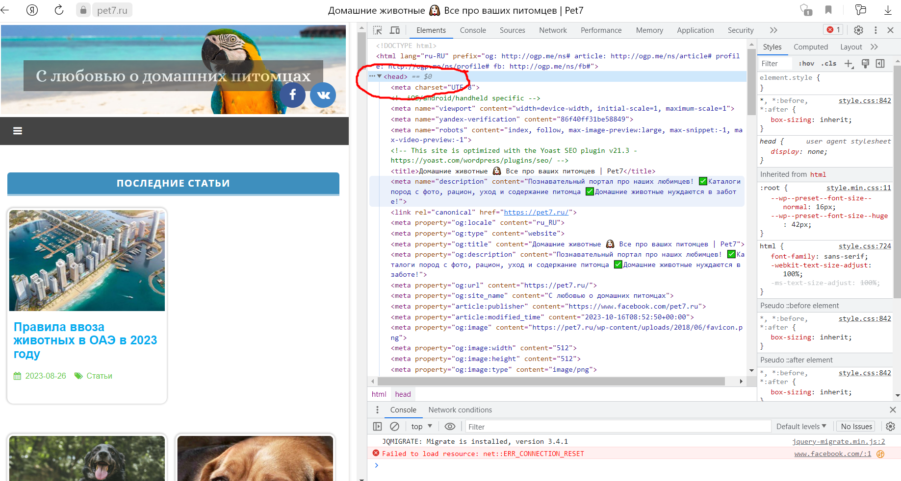
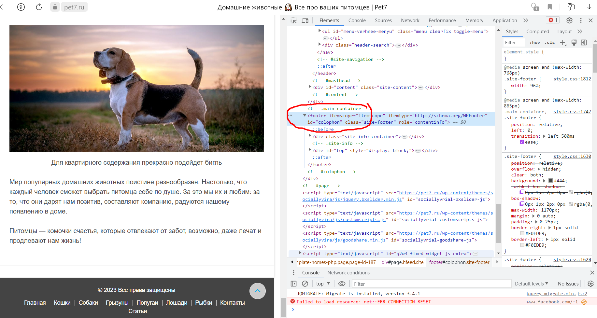
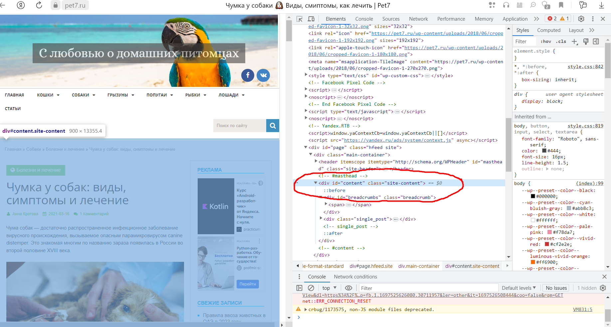
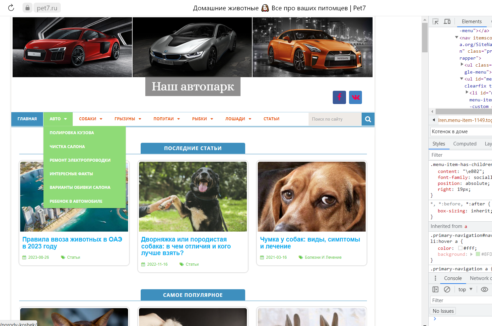
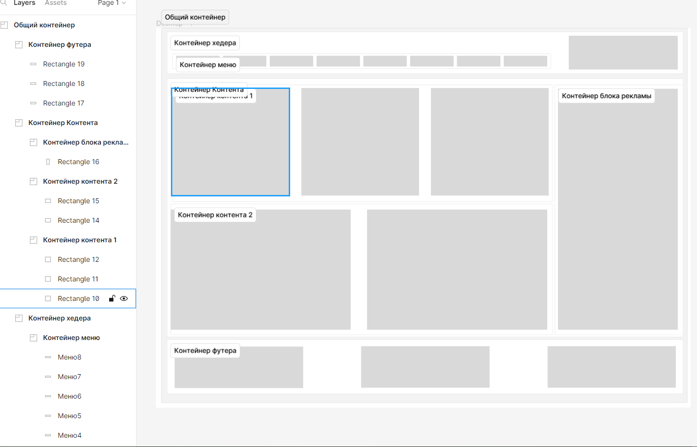

Тема Знакомство с веб-технологиями (семинары)
Урок 1 Домашнее задание

Задача: на основе сайта https://pet7.ru/

1. Определите, на каком протоколе работает сайт.

Ответ: Сайт работает на протоколе https

2. Проанализируйте структуру страницы сайта. Покажите в коде где хедер, футер и контент.

Ответ: это хедер

Ответ: это футер

Ответ: отсюда и ниже - контент

3. Внесите не менее 3 изменений на страницу с помощью инструмента разработчика и представьте скриншоты было/стало.

Внесены изменения в дизайн сайта

4. Создайте прототип низкой детализации.

Добавлен прототип сайта низкой детализации, посмотреть его можно еще по ссылке [это прототип сайта низкой детализации](https://www.figma.com/file/zpfcZGSRm5X46RArpANUex/%D0%9F%D1%80%D0%BE%D1%82%D0%BE%D1%82%D0%B8%D0%BF-%D1%81%D0%B0%D0%B9%D1%82%D0%B0?type=design&node-id=0%3A1&mode=design&t=IDBCaxdnt6q5Excq-1 "Прототип сайта")

Задание закончено!
